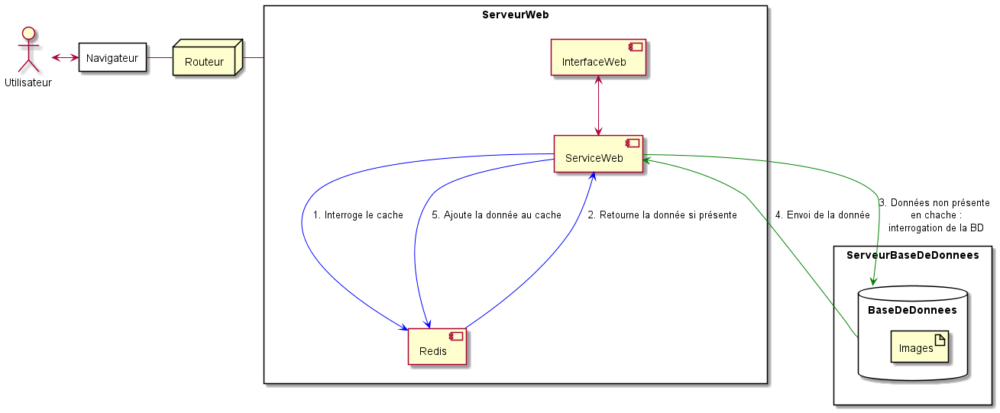

# Monographie - Système de cache et un peu de garbage collection

## Cartouche

 - Code du sujet : 70B
 - Code de l'alliance : 2020A70B 
 - Liste des équipes
   - E09 - Cache-cache
     - Beaugeard, Aurélie (abeaugeard)
     - Campbell, Dylan (d-campbell)
     - Fajardo Luis, Lucia (luciaFajardo)
     
  **Tableau de suivi des versions**
  
| Version | Date de modification            | Modification(s) apportée(s) |
|--------|--------------------|---------------|
| 0.0 | 05/11/2020 | Réalisation intégrale de la première version |
| 0.1 | 22/11/2020 | Tableau de suivi des versions + questions d'amorce + séparation Glossaire et mot-clés + définitions dans le Glossaire + suppression du mot-clé *hero image* dans les mots-clés pour remplacement par *Stockage* + qualification de la référence Oracle In-Memory Database Cache Concepts dans la Webographie + justification du facteur "Efficacité de Stockage"+ ajout de la formule de l'indicateur dérivé *Efficacité* + Ajout de 4 approches techniques dans B1. Description de deux d'entre elles|
| 0.2 | 25/11/2020 | Questions d'amorce + ajout de la qualification de la réference Apache Ignite In-Memory Database dans la Webographie + ajout de sections d'intérêt dans bibliographie pour le livre "The cache memory book, cache data and cache tag memories" + justification du facteur "Efficacité d'exécution" + ajout d'une phrase au lieu de formule dans A.6 car c'est le même facteur dérivé *Efficacité*|
| 0.3 | 27/11/2020 | Ajout de la justication des choix de sections pour la référence bibliographique ***Architecture of Computing Systems - ARCS 2013*** + suppression de la section *Shrinking L1 Instruction Caches to Improve Energy–Delay in SMTEmbedded Processors, page 256* car finalement un peu trop éloigné du sujet + référence du pattern Garbage Collector  |
| 0.4 | 28/11/2020 | Ajout de la justication des choix de sections pour les références bibliographiques + ajout des sources manquantes dans A7 + explication des caractéristiques *Time-to-live*, *Evictions* et *The thundering herd* dans B1|
| 0.5 | 29/11/2020 | Ajout de la justication des solutions technologiques **Memcached** et **Hazelcast** dans B2. Ajout du contenu des parties B3 et B4 + ajout du schéma dans B5|
| 0.6 | 01/12/2020 | Ajout de l'explication de la mesure de la facilité de migration|

## Questions d'amorce

 <ins>Définition des termes suivants : </ins>
 
 + **memory reclamation mechanism** :
 La récupération de mémoire est le mécanisme de création de pages RAM plus libres, en jetant ailleurs les données qui y résident. Lorsque plus de RAM est nécessaire, les données sont supprimées de la RAM (détruites ou copiées dans le fichier swap pour qu'elles puissent être récupérées à nouveau ). Ce mécanisme est nécessaire pour toutes les structures de données dynamiques sans verrouillage et lisibles simultanément, telles que les linkedlist ou queue.
Il faut donc distinguer deux types de suppression, la suppression logique d'un nœud, N (le retirer d'une structure de données partagée de sorte qu'aucune nouvelle référence à N ne puisse être créée), et la suppression physique de ce nœud (permettant de récupérer la mémoire utilisée pour N en vue d'une réutilisation arbitraire). Si un thread T1 supprime logiquement un nœud N d'une structure de données sans verrouillage, il ne peut pas supprimer physiquement N tant qu'aucun autre thread T2 ne contient une référence à N, car la suppression physique de N peut entraîner un plantage ou une exécution incorrecte de T2.
Définiton inspiré de [Memory Reclamation, when and how](https://frankdenneman.nl/2010/06/11/memory-reclaimation-when-and-how/) et [Comparative Performance of Memory Reclamation Strategies ](http://www.cs.toronto.edu/~tomhart/papers/tomhart_thesis.pdf)
 
 + **garbage collection** :
 C'est un mécanisme de gestion de la mémoire implicite mis en œuvre dans certains langages de programmation interprétés ou semi-interprétés. Il libère le programmeur de la gestion manuelle de la mémoire où il spécifie quels objets doivent être désalloués et retournés au système de mémoire. Les principes de base du garbage collection consistent à trouver dans un programme des objets de données auxquels on ne pourra plus accéder à l'avenir, et à récupérer les ressources utilisées par ces objets. (site consulté [Définiton de Garbage collection](https://en.wikipedia.org/wiki/Garbage_collection_(computer_science)#Principles))
 
 + **JEP (dans le monde Java)** : 
 Jep Java analyse et évalue des expressions mathématiques avec seulement quelques lignes de code. Ce progiciel permet aux utilisateurs de saisir une formule sous forme de chaîne de caractères et de l'évaluer instantanément. Jep prend en charge les variables, les constantes et les fonctions définies par l'utilisateur. Un certain nombre de fonctions et de constantes mathématiques courantes sont incluses. (sité consulté [JEP Java](http://www.singularsys.com/jep/))

 + **classe WeakHashMap dans java.util** : Implémentation de l'interface Map de java.util basée sur une table de hachage, avec des clés dites "faibles". Une entrée dans un WeakHashMap sera automatiquement supprimée lorsque sa clé n'est plus utilisée. Plus précisément, la présence d'un mapping pour une clé donnée n'empêchera pas à la clé d'être jetée par le ramasseur d'ordures, c'est-à-dire rendue finalisable, finalisée, puis récupérée. Lorsqu'une clé a été jetée, son entrée est effectivement retirée de la Map, de sorte que cette classe se comporte quelque peu différemment des autres implémentations Map de Java. (définition donnée par la [documentation officielle de Java](https://docs.oracle.com/javase/7/docs/api/java/util/WeakHashMap.html))
 
 + **distributed in-memory data cache** : La "distributed in-memory data cache" ou en français "mise en cache distribuée en mémoire" n'est rien d'autre qu'un cache réparti sur différents nœuds. Il rend les données hautement disponibles pour la ou les applications qui les utilisent. Il s'agit généralement de magasins de clés/valeurs qui prennent en charge les opérations standard put/get ainsi que les capacités de partitionnement, de réplication ou de sauvegarde des données. Par exemple , [Apache](https://ignite.apache.org/use-cases/in-memory-cache.html) propose ce genre de service. (définition inspirée de [Data Science Blog](https://data-science-blog.com/blog/2020/09/25/in-memory-data-grid-vs-distributed-cache-which-is-best/))

## Partie A

### A0 : Introduction

L'objectif de ce projet est de gérer les problèmes liés à l'affichage d'une *hero image* chez une centaine de visiteur simultanément. Il faudra donc exploiter les systèmes de caches et garbage collections. Le cas d'utilisation est le suivant :

"Un utilisateur désire afficher une image, que l'on appellera ici [hero image](https://envato.com/blog/hero-image-trend-in-web-design/) de l'ordre de 50 mb, choisie aléatoirement dans un pool de 5 images."

<!--"Un web container (au sens Java EE), qu’on appelera **CacheMesHeros**, publie une page d’accueil avec une [hero image](https://envato.com/blog/hero-image-trend-in-web-design/) (de l’ordre de 50 mb). L’image est prise aléatoirement dans un pool de 5 images. Cette image est affichée par une centaine de visiteur simultanément." 
On pourra initialiser l’application CacheMesHeros en simplifiant le projet Github suivant : [image-resize-servlet](https://github.com/soulgalore/image-resize-servlet). On peut trouver des images de plusieurs 10aines de Mo sur [WikiPedia](https://stackoverflow.com/questions/33159586/i-need-a-100-mb-test-image) ou simuler une image avec la commande `fallocate -l Image_Size_Here /path/to/image.img`."-->

<!--Il faudra minimiser la configuration de la machine nécessaire et éventuellement d’optimiser le temps de traitement. On utilisera des techniques de cache pour optimiser le chargement des ressources en mémoire.-->

L'objectif ici est de minimiser le temps d'affichage de l'image chez l'utilisateur, ainsi que la configuration de la machine nécessaire, sachant que l'image peut être demandée par une centaine d'utilisateurs simultanément. Nous utiliserons pour ce faire des techniques de cache afin d'optimiser le chargement des ressource en mémoire.

### A1g. Glossaire 

* **Mémoire cache** : "Une mémoire cache ou antémémoire est, en informatique, une mémoire qui enregistre temporairement des copies de données provenant d'une source, afin de diminuer le temps d'un accès ultérieur (en lecture) d'un matériel informatique (en général, un processeur) à ces données." [Wikipédia](https://fr.wikipedia.org/wiki/M%C3%A9moire_cache)

* **Mémoire distribuée** : "La mémoire d'un système informatique multiprocesseur est dite distribuée lorsque la mémoire est répartie en plusieurs nœuds, chaque portion n'étant accessible qu'à certains processeurs. Un réseau de communication relie les différents nœuds, et l'échange de données doit se faire explicitement par *passage de messages*." [Wikipedia](https://fr.wikipedia.org/wiki/M%C3%A9moire_distribu%C3%A9e)

* **Pattern ou Patron de conception** : "En informatique, et plus particulièrement en développement logiciel, un patron de conception (souvent appelé design pattern) est un arrangement caractéristique de modules, reconnu comme bonne pratique en réponse à un problème de conception d'un logiciel." [Wikipedia](https://fr.wikipedia.org/wiki/Patron_de_conception)

* **Servlet** : "Un ou une servlet est une classe Java qui permet de créer dynamiquement des données au sein d'un serveur HTTP. Ces données sont le plus généralement présentées au format HTML, mais elles peuvent également l'être au format XML ou tout autre format destiné aux navigateurs web." [Wikipedia](https://www.google.com/search?client=firefox-b-d&q=servlet)

* **Mémoire Vive (RAM)** : "La mémoire vive, parfois abrégé avec l'acronyme anglais RAM (Random Access Memory), est la mémoire informatique dans laquelle peuvent être enregistrées les informations traitées par un appareil informatique. On écrit mémoire vive par opposition à la mémoire morte." [Wikipedia](https://fr.wikipedia.org/wiki/M%C3%A9moire_vive)

### A1m. Mot-clés

1. Caches
2. Ramasse-miettes
3. Servlet
4. Stockage
5. Optimisation
6. Mémoire
7. Pattern
8. Database
9. Disque 
10. Chargement

### A2. Webographie

1. [Oracle In-Memory Database Cache Concepts](https://docs.oracle.com/cd/E13085_01/timesten.1121/e13073/concepts.htm#TTCAC117) : Explication des concepts fondamentaux du système de cache, présentation des différents type de caches et présentation précise de l'architecture de la base de données cache d'Oracle. (*consulté le 22/11/2020*)
2. [Apache Ignite In-Memory Database](https://ignite.apache.org/use-cases/in-memory-database.html) : Présentation des principes d'une base de données en mémoire avec Apache Ignite, une plateforme open source de mise en cache. (*consulté le 22/11/2020*) 
3. [Amazon : What is caching and how it works](https://aws.amazon.com/caching/?nc1=h_ls) : Présentation générale du principe de mise en cache, et mise en avant de ses avantages. Étude des cas d'utilisation de celle-ci. (*consulté le 25/11/2020*)

### A3. Bibliographie

1. **Architecture of Computing Systems - ARCS 2013**, *Hana Kubátová, Christian Hochberger, Martin Daněk, Bernhard Sick (Eds)*, 26th International Conference Prague, Czech Republic, February 2013, Springer

    <ins>Sections d'intérêt</ins>
    
    * A Multi-core Memory Organization for 3-D DRAM as Main Memory, page 62
    
    Cette section présente l'utilisation de structures DRAM 3D et de mémoires non volatiles telles que les mémoires à changement de phase (PCM)  pour améliorer les latences d'accès et réduire la consommation d'énergie dans les systèmes multi-coeur. Elle traite en outre des mémoires à changement de phase, de la gestion des mémoire 
virtuelles et de l'indexation associative.

    * An Application-Aware  Cache  Replacement  Policy  forLast-Level Caches, page 207
    
    Cette section traite de la politique ACR (Application-aware Cache Replacement) qui assure un suivi dynamique de la durée de vie maximale des lignes de cache partagées pour chaque application concurrente et contribue à une utilisation efficace de l'espace de cache. 
 
2. **The cache memory book, cache data and cache tag memories** Handy, Jim. Morgan Kaufmann Publishers In, 2nd edition édition 1998.

    <ins>Sections d'intérêt</ins>
    
    * What is a Cache Memory ?
    
   Cette section explique le concept de mémoire cache et ses quatre parties fondamentales (l'unité de mémoire, le répertoire, le contrôleur et les buffers qui l'isolent d'un bus partagé). Elle explique également comment la mémoire cache sert à accroître l'efficacité des opérations liées au CPU (Central processing unit), et présente les données de cache et les mémoires de cache-tag.
   
    * How are Caches designed ?
    
    Cette section étudie certaines des méthodes ou "astuces du métier" utilisées dans la conception des caches. Bien qu'aucune technique de conception particulièrement complexe ne soit utilisée, une grande partie de la réflexion est consacrée à examiner de nombreuses règles empiriques spécifiques aux caches afin d'effectuer correctement la conception des caches.

3. **Supercomputing systems: architectures, design, and performance**, *Svetlana P. Kartashev, Steven I. Kartashev, Von Nostrand Reinhold, cop.1990*
   
    <ins>Sections d'intérêt</ins>

    * Cache coherence in mind system: Petri net model for minimal state solution.
    * Optimization of hierarchical memory systems for high-speed computers

    Ces deux sections présentent des applications du caching à des environnements spécifiques, à savoir les environnements de calcul à très haute vitesse. Ce type d'environnement implique une optimisation plus importante des outils utilisés, et donc une utilisation plus avancée du système de cache.

### A4. Acteurs

1. ***Google***:

Google, LLC est une entreprise technologique multinationale américaine spécialisée dans les services et produits liés à Internet, qui comprend des technologies de publicité en ligne, un moteur de recherche, l'informatique en cloud, des logiciels et du matériel. Elle est considérée comme l'une des cinq grandes entreprises technologiques de l'industrie américaine des technologies de l'information, aux côtés d'Amazon, de Facebook, d'Apple et de Microsoft. Google a été fondé en septembre 1998 par Larry Page et Sergey Brin alors qu'ils étaient doctorants à l'université de Stanford en Californie. Google offre des services conçus pour le travail et la productivité (Google Docs, Google Sheets, and Google Slides) mais également d'autre services comme le courrier électronique (Gmail). 

Google a développé un système de cache appliqué aux images, à présent intégré à Gmail. En effet, lorsqu'une image est mise en cache, elle est téléchargée du serveur d'origine et stockée sur un serveur proxy appartenant à Google. Les images ne sont donc affichées qu'une seule fois sur le serveur d'origine tandis que les vues successives proviendront de l'image mise en cache sur les serveurs proxy de Google. Entre autres, les vues ultérieures de l'image mise en cache s'affichent toujours à partir du serveur proxy plutôt que du serveur d'origine, ce qui a pour effet de réacheminer tous les téléchargements d'images ainsi que les données de suivi associées qui accompagnent le téléchargement de l'image.

2. ***Oracle Corporation***:

Oracle Corporation,  entreprise américaine de technologie informatique créée en 1977, est reconnue pour ses systèmes de gestion de base de données. Elle publia en 2014 un livret blanc sur son nouveau système de bases de données en mémoire, "Oracle Database In-Memory". Avec Oracle Database In-Memory, une seule base de données peut désormais prendre en charge efficacement des charges de travail mixtes, offrant ainsi des performances optimales pour les transactions tout en prenant en charge simultanément l'analyse et le reporting en temps réel. Cela est possible grâce à son architecture "dual-format" qui permet de conserver les données à la fois dans le format de ligne Oracle existant, pour les opérations OLTP, et dans un nouveau format de colonne purement en mémoire, optimisé pour le traitement analytique. Cela dit, il n'est plus nécessaire que toutes les données soient stockées dans la mémoire, mais seulement les "tables" ou partitions sensibles aux performances. Oracle Database In-Memory permet également aux "data marts" et aux "data warehouses" de fournir davantage d'analyses ad hoc, donnant aux utilisateurs finaux la possibilité d'exécuter plusieurs requêtes orientées métier dans le même temps qu'il fallait auparavant pour exécuter une seule requête. 

3. ***Amazon***

Amazon, créée en Juillet 1994, est l'une des GAFAM, et donc l'une des plus puissantes entreprises du monde. Roi de la vente en ligne, l'entreprise doit gérer un montant colossal de commandes, et donc de données, à chaque instant. Amazon est ainsi confronté en permanence a des soucis de mise à l'échelle de son système, et donc, à des problèmes de caching. 

L'entreprise a en 2019 publié un livre blanc présentant son service web ElastiCache. Celui-ci facilite le déploiement, l'utilisation, et la mise à l'échelle d'un cache de données en mémoire dans le cloud, ce qui permet d'améliorer la performances des applications web via une récupération des informations plus rapide. 
Ce système se repose sur le déploiement d'un ou plusieurs clusters de cache. Une fois ceux-ci en place, le service automatise de nombreuses tâches administratives, telles que la gestion des stocks, la détection et la correction d'erreurs ou la mise à jour du software. Le système fournit aussi de nombreuses métriques liées aux noeuds de cache afin de pouvoir diagnostiquer les problèmes rapidement. Il est entre autres possible d'être alerté lorsqu'un cache dépasse sa capacité maximale.
Il est important de noter que ce système n'est pas directement lié à la base de données, ce qui lui octroie une grande flexibilité d'utilisation.

### A5. Facteurs qualité

1. **Efficacité de stockage** : "Propriété d'un logiciel qui minimise la place mémoire nécessaire à une opération." [ProgYSM](https://yansanmo.progysm.com/document/93_logiqualdef.htm). Cette définition suffit à justifier ce choix car notre problématique porte exactement sur la minimisation de la place mémoire nécessaire à une opération.

2. **Efficacité d'exécution** : "Propriété d'un logiciel qui utilise un minimum de temps machine pour l'accomplissement de ses fonctionnalités."[ProgYSM](https://yansanmo.progysm.com/document/93_logiqualdef.htm). Ce critère a été choisi car l'objectif de notre projet est de minimiser la configuration de la machine nécessaire et optimiser le temps de traitement, or ce facteur répond parfaitement à ces attentes.  

3. **Facilité de migration** : Lorsque l'on conçoit un système, il est important de toujours penser à la mise à l'échelle de celui-ci, soit à la migration vers un environnement à plus grande échelle. Le cacheing est une solution efficace pour maintenir un niveau de performance lors du passage d'un système à une échelle plus élevée.

### A6. Indicateurs qualité

**Efficacité de stockage**

<ins>Indicateurs de base</ins>
- Capacité fonctionnelle
- Fiabilité

<ins>Indicateurs dérivés</ins>
- Efficacité :
  * Formule : 
    + Où S est le service rendu par le logiciel et E sont les efforts qu'il faut entreprendre pour le faire fonctionner (la quantité de ressources utilisées par exemple). Ce rapport donne une qualification de l'efficacité

**Efficacité d'exécution**

<ins>Indicateurs de base</ins>
- Fiabilité
- Facilité d'utilisation

<ins>Indicateurs dérivés</ins>
- Efficacité
  * Formule : La formule est décrite dans le critère précédent. 

**Facilité de migration**

<ins>Indicateurs de base</ins>
- Fiabilité
- Rendement/Efficacité

<ins>Indicateurs dérivés</ins>
- Portabilité
  * Formule : ?

### A7. Références théoriques

| Numéro | Pattern            | Problème géré |
|--------|--------------------|---------------|
| 1      | Caching            | Optimisation des performances lors du chargement répété d'une ressource              |
| 2      | Cache-Aside        | Maintien de la cohérence entre le cache et la ressource distante              |
| 3      | Garbage Collection | Garantie de l'absence de fuites mémoire              |
| 4      | Garbage Compactor  | Défragmentation et récupération de la mémoire libérée              |

**Caching**

Le Caching Pattern permet l'optimisation de l'usage des ressources machine lors du chargement répété de données, notamment depuis une source distante. Cela permet l'optimisation des performances de la machines lors des accès à ces données. 
Ce pattern est utilisé lorsque les ressources qui seront demandées sont prévisibles.

Afin d'atteindre cet objectif, le Caching Pattern stocke les données auquelles la machine a déjà accedé localement, ce qui permet ensuite de les recharger rapidement pour les réutiliser, sans avoir à les redemander auprès de la source distante. Lorsque les ressources stockées ne sont plus nécessaires, elles sont libérées pour gagner en espace mémoire. Elles devront cependant refaire l'objet d'une requêtes à la source pour être rechargées après cela.

*Source : [Caching Patterns and Implementation](http://citeseerx.ist.psu.edu/viewdoc/download?doi=10.1.1.648.9851&rep=rep1&type=pdf), consulté le 05/11/2020.*

**Cache-Aside**

Lors de l'utilisation d'un cache, il serait utopique de penser que les données mises en cache seront toujours conformes aux données distantes, et ce quoiqu'il arrive. Il est très fréquent, notamment lors d'accès concurrents à une ressource, que celle-ci soit modifiée tandis qu'elle se trouve dans le cache d'un utilisateur. C'est le problem que cherche à résoudre le Cache-Aside pattern. 

De nombreux systèmes aujourd'hui contournent ce problème en intégrant des opérations de double lecture et d'écriture différée. Ainsi, les modifications apportées au données du cache sont immédiatement répercutées sur la base de données. Tout cela est possible si l'application récupérant les données établit une référence au cache.

Cependant, dans le cas ou le cache n'intégrerait pas ces fonctionnalités, le pattern Cache-Aside permet d'émuler la double lecture. A la récupération de la donnée distante, une copie de celle-ci est sauvegardée dans le cache. Lors de la mise à jour d'un élément en cache, l'application peut ainsi écrire directement sur la base de données, puis invalider l'élément en cache.

*Source : [Modèle Cache-Aside](https://docs.microsoft.com/fr-fr/azure/architecture/patterns/cache-aside), consulté pour la dernière fois le 05/11/2020.*

**Garbage Collection**

Le Garbage Collection Pattern traite les défauts d'accès à la mémoire de manière propre et simple pour le programmeur d'applications. L'implémentation standard de ce modèle ne résout pas le problème de la fragmentation de la mémoire (voir Garbage Collector) mais il permet au système de fonctionner correctement face à une mémoire mal gérée. 

Les fuites de mémoire se produisent lorsque les programmeurs se trompent sur le moment et la manière dont la mémoire doit être désallouée. La solution offerte par le Garbage Collection Pattern supprime les défauts en mettant le programmeur hors de la boucle - le programmeur ne désalloue plus explicitement la mémoire. En retirant le programmeur, cette source de défauts disparaît.

Le Garbage Collection Pattern effectue une « collecte de déchets » par marquage et balayage. En effet, il existe une phase dite de « marquage » suivie d’une phase de « récupération ». Lors de la création d’objets, ces derniers vont être marqués comme "objets vivants". La phase de marquage s’exécute suite à un manque de mémoire ou à une demande explicite d'effectuer le ramassage des ordures. Lors du marquage, on vérifie que tous les objets stockés sont vivants. Ainsi, les objets n’ayant pas pu être atteints sont marqués comme morts. La phase de balayage intervient à ce moment là pour récupérer les objets morts et libérer de l’espace mémoire.

*Source* : [Real Time Design Patterns: Memory Patterns](https://www.informit.com/articles/article.aspx?p=30309&seqNum=6), *(consulté le 05/11/2020)*

**Garbage Compactor**

Lors de la fragmentation, la mémoire libre est divisée en blocs non contigus. Or, la plupart des applications qui allouent et libèrent dynamiquement des blocs finissent par se retrouver dans une situation où, bien que la mémoire totale soit suffisante pour répondre à la demande d'allocation, il n'y a pas un seul bloc contigu suffisamment grand, entraînant l'échec de l'application. Le Garbage Collection Pattern répond à cette problématique.

Le Garbage Collection Pattern est une variante du "Garbage Collection Pattern". Tout comme lui, il traite la libération de la mémoire, mais en gérant à la fois la défragmentation et récupération automatique de la mémoire libérée pour qu'elle commence alors comme un bloc contigu.

Il atteint cet objectif en maintenant deux segments de mémoire dans le tas. Lors de la collecte des déchets, les objets vivants sont déplacés d'un segment à l'autre, de sorte que dans le segment cible, les objets soient juxtaposés l'un à côté de l'autre. La mémoire libre est ainsi sous la forme d'un seul grand bloc contigu.

*Source* : [Real Time Design Patterns: Memory Patterns (Garbage Compactor Pattern)](https://www.informit.com/articles/article.aspx?p=30309&seqNum=7), *(consulté le 04/11/2020)*

## Partie B

### B1. Approche technique

Amazon a fourni une documentation assez complète sur les systèmes de cache en général. Il présente notamment [les bonnes pratiques de cache](https://aws.amazon.com/fr/caching/best-practices/) de façon détaillée. Nous nous servons donc de ces informations pour présenter les principales caractéristiques des différentes approches techniques portant sur les systèmes de cache.

+ **Lazy caching ou Cache-aside** : 

Il s'agit de la forme de mise en cache la plus répandue. Elle peut être considérée comme base à toute bonne stratégie de mise en cache. L'idée de base est de ne remplir le cache que lorsqu'un objet est  demandé par l'application. Voici les différentes étapes de cette approche :

 1. L'application reçoit une requête de données, par exemple les taux d'échange de diférentes monnaies
 2. L'application va vérifier si cet objet qu'il a reçu se trouve dans le cache ou non
  + Si oui, c'est l'objet stocké dans le cache qui est renvoyé et le flux d'appel se termine.
  + Dans le cas contraire, la base de données est interrogée afin de trouver l'objet requis. Celui-ci est alors stocké dans le cache puis renvoyé.
  
<ins>Les avantages de cette méthode par rapport aux autres méthodes sont multiples :</ins>

* D'abord, le cache ne contient que les objets réellement demandés par l'application, ceci permettant la gestion de la taille du cache. En effet, les nouveaux objets ne sont ajoutés au cache qu'en cas de besoin. 
* Le développement de l'application peut entraîner la mise en ligne de nouveaux *noeuds de cache*. La technique cache-aside permet le remplissage automatique de ces nouveaux noeuds à chaque fois qu'un objet inconnu est demandé.
* L'expiration du cache est simplement gérée par la suppression de l'objet mis en cache. 
* Cette technique étant largement répandue, de nombreuses applications web ou frameworks proposent une prise en charge instantanée de celle-ci. 

<ins>Illustration du cache aside en Python</ins>

<pre><code># Python

def get_user(user_id):

    # Check the cache

    record = cache.get(user_id)

    if record is None:       

       # Run a DB query       

       record = db.query("select * from users where id = ?",user_id)

       # Populate the cache

       cache.set(user_id, record)

    return record
</code></pre>
<pre><code># App code

user = get_user(17)
</code></pre>

+ **Write-through** :

Cette technique est définie comme "cache en écriture" car elle propose une mise à jour en temps réel du cache dès que la base de donnée est soumise à une mise à jour. Ce système de cache doit être utilisé dans un contexte où les données sont très susceptibles d'être demandées mais aussi fréquemment sujettes à des actualisations. Ceci permet d'éviter des oublis inutiles dans la mémoire cache. Cela peut par exemple concerner les données d'un profil utilisateur ou encore les cours boursier, etc.

<ins>"Write-through" possède certains avantages sur le "Lazy caching" :</ins>

+ Performance supérieure quant à la limitation des objets manquants dans le cache. Ceci permet d'éviter l'impression de lenteur d'exécution (d'un point de vue expérience utilisateur) engendrée par l'absence de certains objets dans le cache.
+ Appliction plus vive
+ Tout retard de l'application dépend de la mise à jour des données lancée par l'utilisateur (plus conforme aux attentes de l'utilisateur). 
+ Expiration du cache d'autant plus simplifiée grâce à la constante mise à jour du cache.

<ins>Cependant, cette technique présente également quelques points faibles :</ins>

-  Le cache peut être rempli d'objets inutiles qui ne sont pas réellement accessibles. Cela peut engendrer une consommation de mémoire supplémentaire et les objets non utilisés risquent d'expulser du cache des objets plus utiles.
-  La mise à jour répétée de certains enregistrements peut entraîner une forte rotation de la mémoire cache.
-  Si les noeuds du cache "tombent en panne", nous risquons de nous retrouver avec un cache vide ne pouvant se repeupler par le système du "write-though". Il faudra donc opter pour le cache aside afin de remplir le cache à nouveau.

<ins>Voici une illustration de ce système en pseudocode python :</ins>

<pre><code># Python

def save_user(user_id, values):

    # Save to DB 

    record = db.query("update users ... where id = ?", user_id, values)

    # Push into cache

    cache.set(user_id, record)

    return record
</code></pre>
<pre><code># App code

user = save_user(17, {"name": "Nate Dogg"})
</code></pre>

<ins>Conclusion</ins>

On observe que ce système apporte certains avantages par rapport au lazy caching suivant le contexte. Cependant, le lazy caching semble incontournable pour palier les problèmes de panne du write-through. Il pourrait donc être judicieux de combiner les deux si l'utilisation du cache write-through porte un intérêt dans notre cas d'utilisation.

+ **Time-to-live**
  
Le problème d'expiration du cache est extrêmement important à prendre en compte lors de la conception de celui-ci, mais il peut rapidement devenir compliqué. En effet, en environnement réel, le cache contient généralement énormément d'informations à la fois, et toutes mises à jour de différentes façons.

Il n'éxiste malheureusement pas de solution miracle à ce problème. Néanmoins, on peut citer plusieurs stratégies simples qu'il est possible d'utiliser :

* Appliquer un temps de vie (ou time to live, TTL) à chaque clé du cache, sauf celles mises à jour en Write-Through. Le temps peut être long, que ce soit plusieurs heures ou mêmes jours. Cette technique permet de détecter les bugs de l'application, les oublis de mise à jour ou la suppression d'une clé de cache pendant une mise à jour. Une fois le TTL dépassé, la clé expirera et sera mise à jour.
* Pour les données changeant fréquemment, privilégier un TTL court, même juste de quelques secondes. Cela représente une solution simple dans les cas ou la base de données est très fréquemment appelée.
* Un pattern plus récent : "*Russian Doll Caching*", nous vient du travail de l'équipe Ruby on Rails. Dans celui-ci, les enregistrements de "plus bas niveau" possèdent leur propre clé de cache, tandis que les ressources de haut niveau sont des collections de ces clés. Prenons l'exemple d'une page web contenant un utilisateur, des commentaires, etc. Ici, chaque élément possèdera sa propre clé de cache, et la page effectuera des requêtes sur chaque clé de façon distincte.
* Dans le cas où l'on n'est pas sur de si une clé est affecté par une mise à jour ou pas, on la supprime. Le Lazy Caching la régénérera plus tard au besoin, et en attendant, la base de fera pas pire que sans caching.

+ **Evictions**

L'expulsion est un phénomène qui se déclenche lorsque la mémoire du cache est surchargée. Celui-ci va ainsi commencer à supprimer des clés de sorte à récupérer de l'espace mémoire. Les clés expulsées dépendent de la politique d'expulsion du cache. On peut distinguer de nombreuses politiques, dont entre autres :

* allkeys-lfu : Le cache expulse la clé la moins fréquemment utilisée, sans regarder le TTL.
* allkeys-lru : Le cache expulse la clé utilisée le moins récemment, sans regarder le TTL.
* volatile-lfu : Le cache expulse la clé la moins fréquemment utilise parmi celles qui disposent d'un TTL.
* volatile-lru : Le cache expulse la clé utilisée le moins récemment parmi celles qui disposent d'un TTL.
* volatile-ttl : Le cache expulse la clé avec le TTL le plus court.
* volatile-random : Le cache expulse aléatoirement une clé disposant d'un TLL.
* allkeys-random : Le cache expulse aléatoirement une clé, sans regarder le TTL.
* no-eviction : Le cache n'expulse aucune clé. Il est alors inutilisable jusqu'à ce que de la mémoire soit libérée.

Les stratégies LRU sont les plus couramment utilisées, mais il peut être intéressant de se tourner vers d'autres stratégies selon vos besoins. Enfin, lorsqu'un problème d'expulsion est détecté, c'est généralement le signe qu'une mise à l'échelle est nécessaire, que ce soit par l'ajout de noeuds de cache ou pas l'utilisation de noeuds avec plus de mémoire.

+ **The thundering herd**

L'effet "thundering herd", également appelé "dog piling", se produit lorsque plusieurs processus d'application différents demandent simultanément une clé de cache, obtiennent une erreur de cache (cache miss, c'est à dire l'application demande des données qui ne sont pas actuellement dans la mémoire cache), et que chacun d'entre eux effectue en parallèle la même requête dans la base de données. Plus cette requête est complexe et coûteuse, plus important sera son impact sur la base de données. L'ajout de TTL à toutes les clés de cache peut aggraver ce problème. Par exemple, disons que des millions de personnes suivent un utilisateur populaire sur votre site. Cet utilisateur n'a pas mis à jour son profil ni publié de nouveaux messages, et pourtant le cache de son profil expire toujours en raison d'une TTL. La base de données pourrait soudainement être submergée par une série de requêtes identiques.

Hormis les TTL, cet effet est également fréquent lors de l'ajout d'un nouveau nœud de cache, car la mémoire de ce dernier est vide. Dans les deux cas, la solution consiste à préchauffer le cache en suivant les étapes suivantes :

  1. Rédiger un script qui exécute les mêmes requêtes que l'application.
  2. Si l'application est configurée pour une mise en cache paresseuse (lazy caching), les erreurs de cache entraîneront le remplissage des clés de cache et le nouveau nœud de cache se remplira.
  3. Lorsque de nouveaux nœuds de cache sont ajoutés, exécuter le script avant d'attacher le nouveau nœud à l'application. 
  4. Si vous prévoyez d'ajouter et de supprimer régulièrement des nœuds de cache, le préchauffage peut être automatisé en déclenchant l'exécution du script à chaque fois que votre application reçoit un événement de reconfiguration de cluster par le biais d'Amazon Simple Notification Service (Amazon SNS).
  
  Enfin, il y a un dernier effet secondaire subtil de l'utilisation des TTL partout. Si la même durée de TTL (disons 60 minutes) est utilisée de manière constante, de nombreuses clés du cache peuvent expirer dans le même laps de temps, même après avoir préchauffé le cache. Une stratégie facile à mettre en œuvre consiste à ajouter une certaine dose de hasard au TTL :

 <pre><code># Python
 ttl = 3600 + (rand() * 120)
 </code></pre>
 
 La bonne nouvelle est que seuls les sites à grande échelle doivent généralement s'inquiéter de ce niveau de problème d'échelle, mais il est bon d'en être conscient.
 
### B2. Solutions technologiques concurrentes

Nous avons opté pour le lazy caching qui est à priori la base des bonnes pratiques de cache.

Voici trois solutions technologiques concurrentes mettant en oeuvre le lazy caching ou cache-aside :

Site officiel de Redis : https://redis.io/

"Redis, qui signifie Remote Dictionary Server (Serveur de dictionnaire à distance), est un système de stockage de données clé-valeur en mémoire, open source et rapide, pour une utilisation en tant que base de données, de cache, de courtier de messages (message broker) et de file d'attente." (d'après [Amazon](https://aws.amazon.com/fr/redis/), inspiré par la définition de la documentation de Redis)

Redis dispose de nombreux cas d'usage et parmi ceux les plus répandus, il y a la **mise en cache**.

"Redis est écrit en ANSI C et fonctionne dans la plupart des systèmes POSIX comme Linux, BSD, OS X sans dépendances externes. Linux et OS X sont les deux systèmes d'exploitation où Redis est le plus développé et testé, et nous recommandons d'utiliser Linux pour le déploiement. Redis peut fonctionner dans des systèmes dérivés de Solaris comme SmartOS, mais le support est assuré au mieux. Il n'y a pas de support officiel pour les builds de Windows." (d'après la [documentation officielle de Redis](https://redis.io/topics/introduction), consultée le 28 novembre 2020)

Elle est hautement disponible et est utilisée pour :

+ réduire la latence d'accès aux données
+ augmenter le débit
+ alléger la charge de la base de données et de l'application relationelle ou NoSQL
+ mettre en cache des requêtes de base de données, de sessions persistantes, de pages Web et d'objets souvent utilisés comme des **images**, des fichiers et des métadonnées pour citer les exemples les plus communs

En outre, Redis offre plusieurs services de cache (**cache-aside (Lazy-loading)**, Write-Behind, Write-Back, Write-Through et Read-replica)

**Cache-aside** est la façon la plus courante d'utiliser Redis comme cache.  Les applications lourdes en lecture peuvent grandement bénéficier de la mise en œuvre d'une approche de cache-aside. 

<ins>Avantages :</ins>

1. **Stockage de données en mémoire** 
   * Contrairement aux BDs sur disque, où la plupart des opérations nécessitent un aller-retour au disque, les stockages de données en mémoire ne subissent pas ce désavantage => Ceci augmente le nombre d'opérations pouvant être pris en charge et diminue le temps de réponse 
2. **Rapidité d'exécution**
   * Notamment grâce à ce qui a été expliqué précédemment
   * Accès aux données en quelques microsecondes
3. **Structure de données flexilbles**
   * Chaînes de caractères
   * Listes
   * Ensembles
   * Ensembles ordonnées
   * Hachages
   * Bitmaps
   * HyperLogLogs (structure de données basée sur la probabilité permettant d’estimer les éléments uniques d’un ensemble de données)
4. **Simplicité et facilité d'utilisation**
   * Simplification du code (moins de ligne de codes)
   * Structure de données natives et beaucoup d'options pour les manipuler et les faire interagir
   * Plus d'une centaine de clients open source disponibles
   * Langages pris en charge : Java, Python, PHP, C, C++, C#, JavaScript, Node.js, Ruby, R, Go, etc.
5. **Réplication et persistance**
   * Architecture principal-réplica
   * Prise en charge de la réplication asynchrone (réplication des données sur plusieurs serveurs réplicas)
   * Meilleures performances de lecture + meilleure récupération lorsque le serveur principal subit une panne
6. **Disponibilité et persistance élevées**
7. **Extensibilité**
   * Aucun verrou propriétaire ou technologique
   
<ins>Inconvénients</ins>

1. Redis n'est pas capable de stocker des objets complexes et de comprendre le graphique de l'objet 
   * Le développeur doit modéliser le graphe en une série d'entrées de clé/valeur où une partie de la clé représente une propriété et sa valeur
2. Il est impossible de diviser les données en utilisant des concepts tels que les tables
   * Tout est tocké dans un espace de noms, par exemple la base de données
   * Cela oblige l'élaboration de schémas complexes d'espaces de noms à l'intérieur des clés
3. Redis ne supporte pas nativement les index 
   * Nécessité de créer ses propres structures d'index et de les mettre soit-même à jour et de s'y référer. Ceci est décrit dans la [documentation de Redis](https://redis.io/topics/indexes)

Les informations ci-dessus sont extraites de [la page consacrée à Redis sur Amazon](https://aws.amazon.com/fr/redis/), consulté le 28 novembre 2020.

Les inconvénients sont extraits de [Compare Redis and Hazelcast](https://hazelcast.org/compare-with-redis/), consulté le 28 novembre de 2020

Site officiel de Hazelcast : https://hazelcast.com

Hazelcast IMDG est une solution open source in-memory Java permettant d’accélérer les bases de données et les applications à l’aide de clusters dédiés. La plateforme de type *data grid* est conçue pour servir de cache de données pour les charges de travail à haut volume d'informations et à faible latence transactionnelle. Dans une grille Hazelcast, les données sont réparties uniformément entre les nœuds d'un groupe d'ordinateurs, ce qui permet une mise à l'échelle horizontale du traitement et du stockage disponible. Des sauvegardes sont également réparties entre les nœuds afin de se prémunir contre toute défaillance d'un seul nœud. Hazelcast utilise la base de données relationnelle en plus de la mémoire primaire pour le stockage des données.

Hazelcast peut fonctionner sur site, dans le nuage (Amazon Web Services, Microsoft Azure, Cloud Foundry, OpenShift), virtuellement (VMware) et dans des conteneurs Docker. Parmi les cas d'utilisation typiques pour Hazelcast l'on trouve :

+ Base de données clé-valeur
+ Stockage de données NoSQL
+ Cache-as-a-service
+ Distributed cache
+ In-memory processing
+ Infrastructure des micro-services, Spring Cache, entre autres.

À première vue, Hazelcast et Redis sont très similaires. Ils peuvent s'attaquer à des cas d'utilisation similaires, notamment la mise en cache (*caching*), il peut être donc difficile de décider lequel utiliser. 

**Caching :** 

Hazelcast offre une très grande variété de modèles de mise en cache. Les plus courants sont **cache-aside**, Read-Through, Write-Through, Write-Behind et Near Cache.

<ins>Avantages :</ins>

Rapidité, performance en mémoire, facilité de développement et évolutivité sont les principales avantages.

1. **Vitesse et évolutivité** 
   * La rapidité du traitement de l'information est grande, quel que soit le secteur ou l'application. 
   * Hazelcast offre la plus faible latence disponible combinée à un stockage haute densité pour optimiser les performances dans les conditions les plus exigeantes.
   * La plateforme In-Memory Computing de Hazelcast offre des solutions de mise en cache en mémoire de classe mondiale, basées sur une architecture distribuée qui est extrêmement rapide et évolutive de manière transparente.
2. **Sécurité**
   * Basé sur une architecture de cryptographie Java, Hazelcast offre une communication TLS/SSL et un cryptage symétrique, soutenu par une authentification basée sur JAAS pour une vérification d'identité enfichable et une sécurité basée sur les rôles.
3. **Langages de programmation**
   * Bien que Hazelcast IMDG soit basé sur le langage de programmation Java, il possède les clients et API de langage de programmation suivants : Java, .NET, C++, Node.js, Python et Go.
4. **Structures de données distribuées**
   * Parmi les collections standard, on peut mentionner : Map, Queue, Ringbuffer, Set, List, Multimap, Replicated Map et Cardinality Estimator.
3. **Clustering**
   * La plupart des opérations de regroupement ou clustering sont traitées automatiquement par Hazelcast, et ne nécessitent pas d'une intervention manuelle.
Comme toute solution technologique, Hazelcast présente également des inconvénients :
4. **Quering**
   * Hazelcast comprend les graphiques d'objets complexes et fournit une query API. Hazelcast dispose également d'un support natif pour les index. Ils peuvent être appliqués via la configuration (XML|YAML) ou dynamiquement via l'API

<ins>Inconvénients</ins>

1. Licence nécessaire pour le SSL
2. Hazelcast n'est pas encore très populaire. Au contraire, Redis est un standard de l'industrie depuis plusieurs années, prouvant sa supériorité sur les solutions de stockage de données distribuées existantes. Une simple recherche dans les tendances de Google permet de visualiser la concurrence au fil du temps.

La comparaison entre les résultats de recherche Github pour "Redis" et "Hazelcast" renforce la popularité de Redis. 

Les informations ci-dessus sont extraites de :

* [Compare Redis and Hazelcast](https://hazelcast.org/compare-with-redis/), consulté le 29 novembre de 2020
* [Hazelcast](https://en.wikipedia.org/wiki/Hazelcast), consulté le 29 novembre 2020.
* [Hazelcast arrive sur le cloud pour accélérer les SGBD et donc les apps](https://www.lemondeinformatique.fr/actualites/lire-hazelcast%C2%A0arrive-sur-le%C2%A0cloud%C2%A0pour-accelerer-les-sgbd-et-donc-les%C2%A0apps-74702.html/), consulté le 29 novembre 2020.
* [Cache Access Patterns](https://hazelcast.org/use-cases/caching/), consulté le 29 novembre 2020.
* [Why Hazelcast](https://hazelcast.com/why-hazelcast/), consulté le 29 novembre 2020.
* [Hazelcast IMDG Reference Manual](https://docs.hazelcast.org/docs/latest-dev/manual/html-single/#preface), consulté le 29 novembre 2020.
* [Moving from Hazelcast to Redis](https://engineering.datorama.com/moving-from-hazelcast-to-redis-b90a0769d1cb), consulté le 29 novembre 2020.

## Memcached 

 

*Site officiel : https://memcached.org/*

Memcached est un système de cache distribué, générique par nature, mais originellement conçu pour augmenter la rapidité des applications web dynamiques en réduisant le taux de charge de la base de données. Concrètement, Memcached permet de récupérer sur le système de la mémoire inutilisée pour la réallouer là où elle est plus nécessaire. Cela permet ainsi un meilleur usage de la mémoire et donc une meilleure optimisation des ressources.

Sur l'image de droite, on peut voir la différence entre un système utilisant Memcached, et un ne l'utilisant pas :

* Sans Memcached, les différents noeuds de cache sont indépendants, octroyant chacun une capacité de cache de 64Mb. Il s'agit d'une stratégie de déploiement classique, mais qui peut souvent gâcher de la mémoire. En effet, si un noeud n'est pas utilisé à sa capacité maximale, la mémoire disponible restante est simplement inutilisée.

* Dans le cas où l'on utilise Memcached, les noeuds de cache sont combinés, permettant à tous les objets d'être stockés et récupérés au même endroit. Cela permet aussi d'éventuellement réallouer différemment la mémoire dans le cas où la différence de charge entre les serveurs serait importante.

<ins>Avantages :</ins>

*Source : https://aws.amazon.com/fr/memcached/*

1. **Simplicité**
   * Memcached est conçu pour être générique par nature, ce qui le rend très facile à utiliser.
   * De plus, de nombreux clients open source sont disponible pour son utilisation.
   * Enfin, il prend en charge un grand nombre de langages, dont Python, Java, C, C++, C#, JavaScript, etc.
2. **Rapidité**
   * Tout comme Redis, Memcached conserve toutes ses données dans la mémoire principale du serveur, plutôt que sur un disque dur.
   * Le résultat est le suivant : une rapidité exceptionnelle, avec des opérations d'écriture et de lecture prenant en moyenne moins d'une milliseconde.
3. **Évolutivité**
   * Memcached utilise une architecture distribuée et multithread, ce qui facilite les mises à l'échelle.
   * Le côté multithread de Memcached permet de plus d'utiliser plusieurs coeurs sur un noeud donné, afin d'augmenter facilement les capacités de calcul.
4. **Communauté**
   * Memcached est un projet open source soutenu par une grande communauté.
   * Grâce à cela, certaines applications telles que WordPress et Django prennent directement en charge son utilisation pour améliorer les performances.

<ins>Inconvénients : </ins>

*Source : https://aws.amazon.com/fr/elasticache/redis-vs-memcached/*

1. Limité aux structures de données simples
   * Memcached ne permet la prise en charge des structures de données complexes, telles que les listes ou les ensembles par exemples.
   * Cela peut parfois limiter ses cas d'utilisations, ou rendre plus complexe la mise en oeuvre de certains outils.

2. Ne prend pas en charge les transactions
   * Memcached ne dispose pas d'un système de transactions, ce qui peut poser problème lorsqu'un enchaînement d'actions viendrait à échouer.

### B3. Solution retenue

Nous avons choisi de retenir Redis comme solution. Sa popularité implique que cette solution possède une plus grande communauté, notamment vis-à-vis d'Hazelcast, et donc un meilleur support. 

Ainsi, il nous paraît plus simple d'utiliser Redis étant donné qu'il s'agirait ici d'une première approche de ce genre de systèmes, et une communauté active implique qu'il y aura des réponses à un plus grands nombre de problèmes.

Nous avons écarté Memcached car il ne gère pas les types de données avancés, notamment les ensembles, qui risquent d'être utile dans notre problématique. En effet, afin de choisir une image parmi un pool aléatoire, il sera pratique d'utiliser cette structure de données, qui est prise en charge par Redis, mais pas par Memcached.

<ins>Description technique</ins>

Redis travaille avec un ensemble de données en mémoire (**in-memory** dataset). En fonction du cas d'utilisation, il peut-être conservé soit en vidant de temps en temps l'ensemble des données sur le disque, soit en ajoutant chaque commande à un log. La persistance est une option pouvant être désactivée, au cas où nous aurions juste besoin d'un cache en mémoire riche en fonctionnalités et en réseau.

La partie B2 explique les différentes foncitonalités de Redis.

La [documentation de Redis](https://redis.io/documentation) fournit des informations complémentaires.

### B4. Liste de métriques

**Efficacité de stockage**:
Pour ce facteur, nous proposons de mesurer le nombre de fois où le système retourne chercher une donnée sur un délai de temps fixé.

1. Capacité fonctionelle :
    Pour ce premier indicateur de base, nous mesurerons le temps d'affichage d'une image

2. Fiabilité :
    Pour ce second indicateur de base, nous mesurerons le nombre de réponses correctes/le nombre de requêtes total. Autrement dit le nombre d'images renvoyées qui correspondent à la requête sur le nombre total d'images demandées
        
**Efficacité d'exécution** : 
Pour ce facteur, nous proposons de mesurer le nombre d'opérations exécutées par seconde (autrement dit le nombre d'images affichées par sec).

1. Fiabilité : Pour l'indicateur de fiabilité nous reprenons les mêmes métriques que précédemment

2. Facilité d'utilisation : Cet indicateur dépendant de l'avis de chaque développeur lors de la mise en place du système, nous pensons qu'il n'est pas vraiment mesurable et plutôt subjectif.

**Facilité de migration** :
La facilité de migration étant un facteur purement qualitatif, nous pensons qu'il ne s'agit pas de quelque chose de mesurable formellement. Ainsi, nous étudierons ce facteur de façon subjective.

### B5. Découpage (WBS) pour réalisation des prototypes

## Partie C

### C1. Architecture solution X

<ins>Explication du diagramme de déploiement :</ins>

L'utilisateur se connecte au site web via son navigateur. Il clique sur le bouton "Afficher une image". Le service Web choisit une image aléatoire et la cherche dans le cache (Redis). Si elle n'est pas présente, il la demande à la base de données qui la lui renvoie. Le service Web va alors récupérer et stocker cette nouvelle image dans le cache. Cette dernière est alors affichée sur l'interface web.  

**Sources**

[Diagramme de déploiement, Wikipédia](https://fr.wikipedia.org/wiki/Diagramme_de_d%C3%A9ploiement) (consulté le 12 décembre 2020)

[Using Redis with Nodejs and MongoDB](https://medium.com/@subhrapaladhi9/using-redis-with-nodejs-and-mongodb-28e5a39a2696) (consulté le 12 décembre 2020)

 
